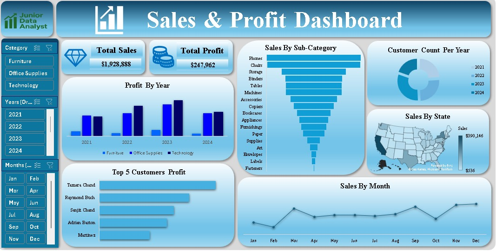

# Excel Sales & Profit Dashboard

This project demonstrates the power of Microsoft Excel in creating professional dashboards for data analysis.

## 📊 Project Details
- **Tool Used**: Microsoft Excel
- **Sheets**:
  - Dataset
  - Pivot Tables
  - Dashboard
- **Features**:
  - Interactive slicers (Category, Year, Month)
  - KPIs (Total Sales, Total Profit)
  - Visuals (Bar charts, Line charts, Map, Funnel chart)

## 🖼 Dashboard Preview

## 🚀 Key Insights
- Total Sales: $1,928,888
- Total Profit: $247,962
- Phones and Chairs are top sub-categories.
- Top customer: Tamara Chand

---

## 📌 How to Use
1. Download the Excel file.
2. Explore the Pivot Tables and Dashboard.
3. Use slicers to interact with data.

---

## ✨ Author
Created by **Nassir Said (Junior Data Analyst)**
